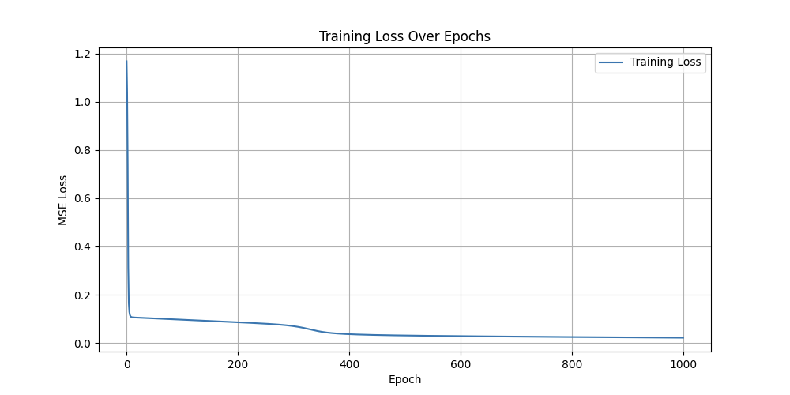
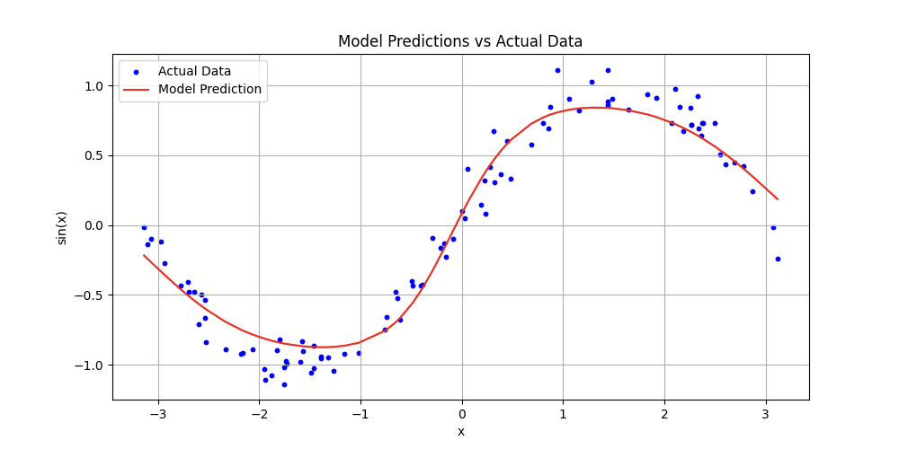
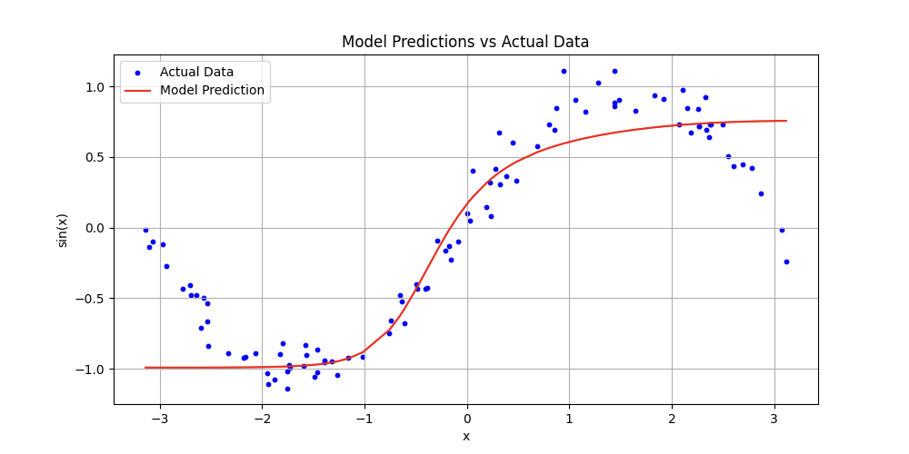
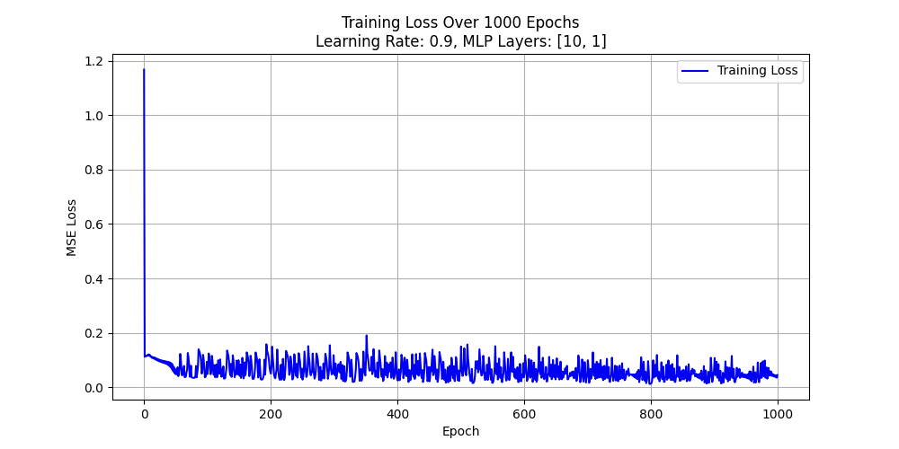
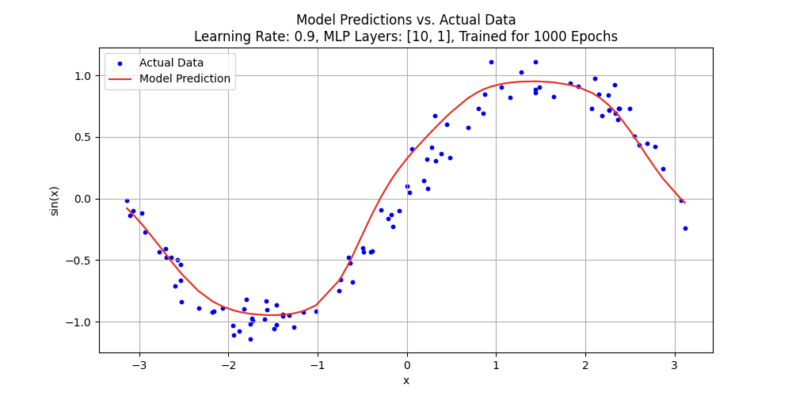

# MicroGrad System Overview

This document provides a structured explanation of the MicroGrad system, detailing the functionality of `engine.py` and `neuralnet.py`, and how they interact to construct a basic yet functional neural network.

---

## 1. engine.py – Automatic Differentiation and Backpropagation

### Auto-Differentiation (Autograd)
Automatic differentiation is a fundamental concept in modern machine learning, particularly in deep learning frameworks such as TensorFlow and PyTorch. These frameworks automate gradient computation, enabling efficient model training without manual derivative calculations.

In MicroGrad, the `Value` class provides a simplified version of this mechanism by tracking:
- **Data** – The numerical value.
- **Gradient** – The partial derivative of the final output with respect to this value.
- **Operation** – The mathematical operation that generated it (e.g., `+`, `*`, `tanh`).
- **Computation Graph** – References to child nodes involved in the computation.

For example, performing `z = x * y` generates a new `Value` instance (`z`), which maintains a computational relationship with `x` and `y`, allowing for gradient propagation.

### Backpropagation via `backward()`
- Calling `backward()` on the final output (e.g., a loss function) initiates backpropagation.
- The function automatically traverses the computational graph in reverse (using topological sorting) and applies the chain rule to accumulate gradients.
- This mechanism mirrors how mainstream deep learning libraries compute and store gradients during training.

---

## 2. neuralnet.py – Constructing a Neural Network

This module implements a compact neural network framework using the `Value` class from `engine.py`.

### Core Components
- **Neuron:** The fundamental unit of the network, consisting of a set of weight parameters (`Value` objects) and a bias term. Each neuron performs a weighted sum of inputs plus bias, followed by an activation function (e.g., `tanh`).
- **Layer:** A collection of neurons. During the forward pass, each input is processed through all neurons in the layer, yielding an output list.
- **MLP (Multi-Layer Perceptron):** A composition of multiple layers where data propagates sequentially through each layer.

---

# 3. test_neuralnet.py – Training the Neural Network

In this script, we implement a standard supervised learning approach to train our neural network. Here’s an overview of the process:

## Training Workflow

- **Dataset Generation:**  
  We generate a dataset of noisy sine (`sin(x)`) values to serve as our training examples.

- **Loss Function:**  
  The model’s performance is measured using the Mean Squared Error (MSE).

- **Training Loop:**  
  For each training epoch, the following steps are executed:
  
  - **Forward Propagation:**  
    The input data is fed through the network.
    
  - **Loss Calculation:**  
    MSE is computed based on the network’s output.
    
  - **Backpropagation:**  
    We call `backward()` to compute gradients for each parameter.
    
  - **Parameter Update:**  
    We update the weights using gradient descent with the update rule:
    ```python
    param.data -= learning_rate * param.gradient
    ```
    
  - **Resetting Gradients:**  
    After each update, gradients are cleared to prepare for the next iteration.

## Training Results

### Loss Reduction Over Epochs



- At the start, the loss decreases rapidly, showing that the network is quickly learning the underlying pattern.
- As training continues, the loss reduction becomes more gradual, reflecting the fine-tuning of the network’s parameters.

### Model Predictions vs. Actual Data



- The red curve represents the network’s predictions, while the blue dots indicate the actual noisy sine data.
- The close match between the predictions and the actual data demonstrates that the network has effectively learned the sine function.

---

# 4. Impact of Learning Rate Adjustments

### Lowering the Learning Rate (0.1 → 0.01)



- With a reduced learning rate, the parameter updates are smaller, which slows down convergence.
- Within the same number of epochs, the model appears underfitted and does not fully capture the sine wave structure.

### Raising the Learning Rate (0.1 → 0.9)



- A higher learning rate leads to larger parameter adjustments, resulting in a sharp initial drop in loss.
- However, this also introduces significant oscillations in the loss values.



- Although the network still manages to capture the general sine pattern, the higher learning rate causes the model to overfit, capturing too much of the noise present in the training data.

---